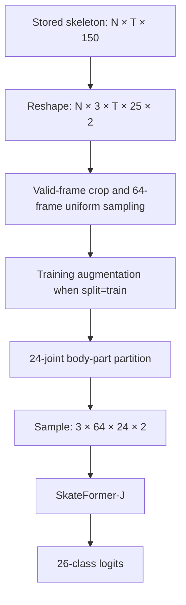
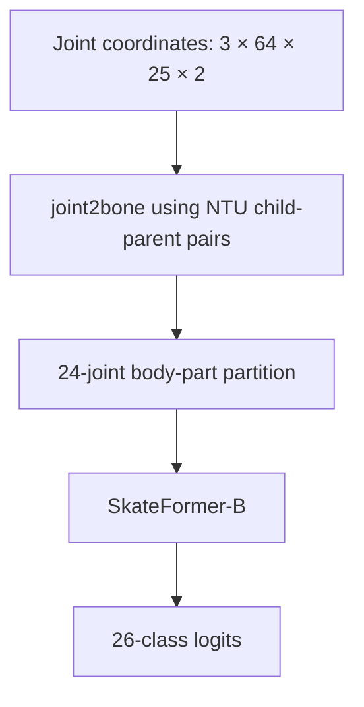
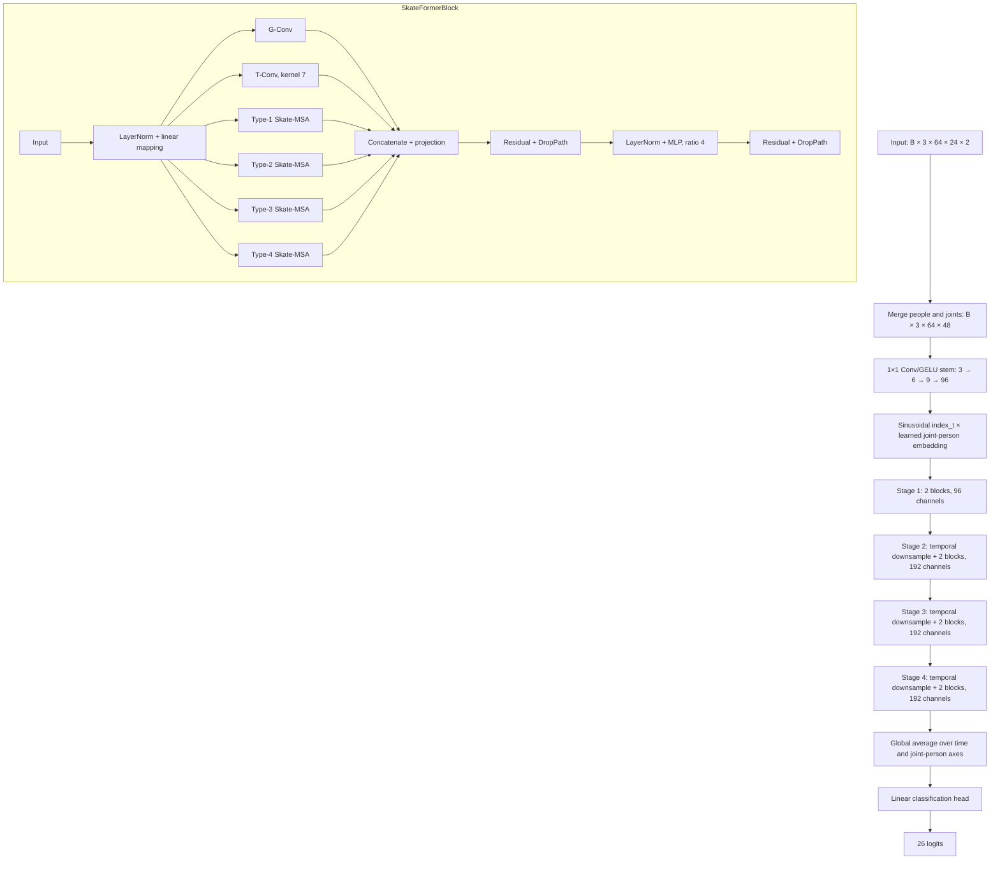
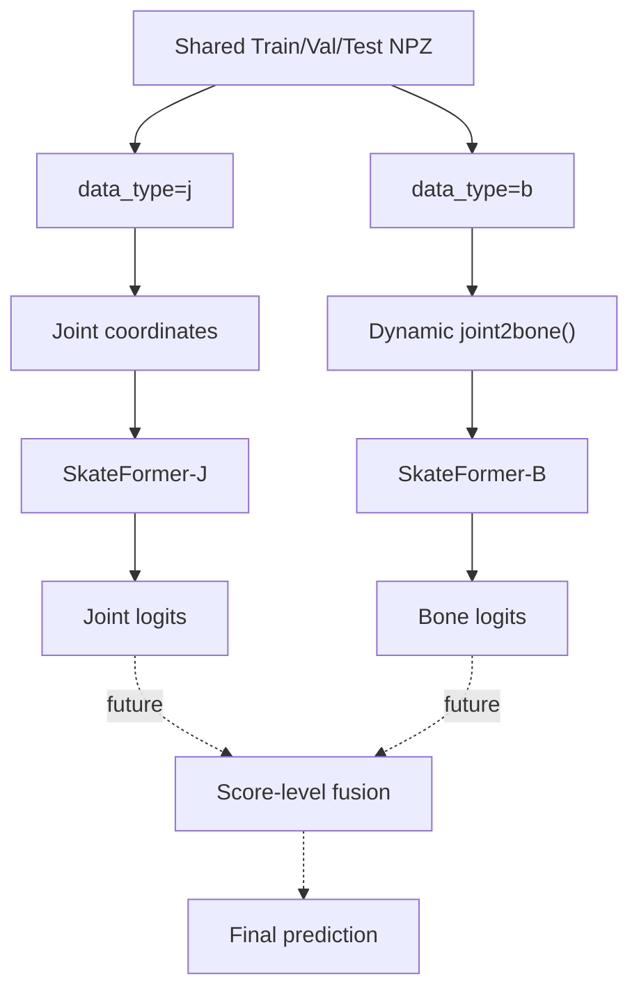
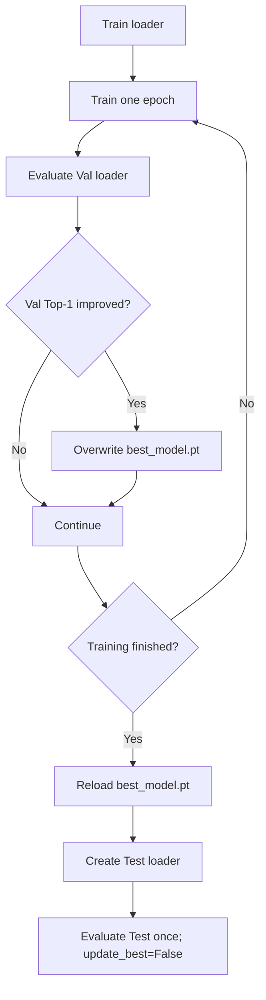
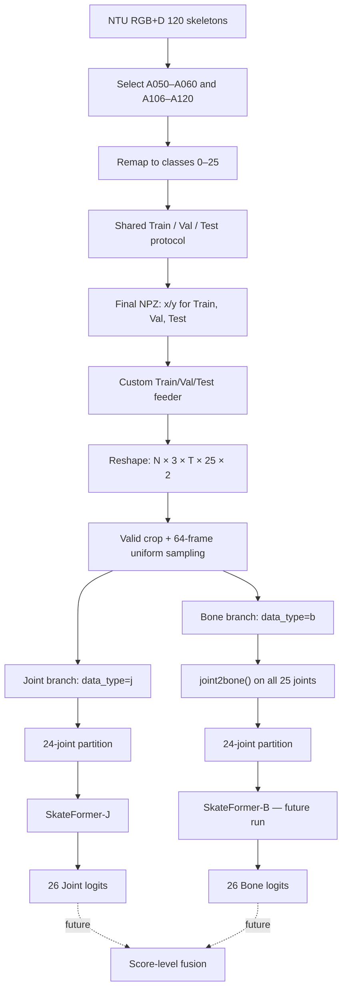
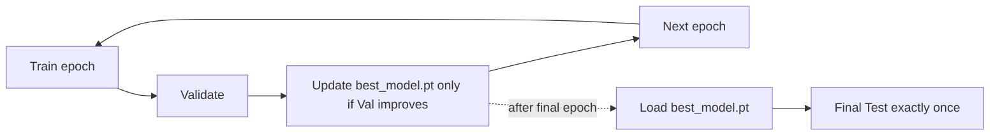

# SkateFormer Interaction-26 Processing and Training Report

This document describes the SkateFormer baseline as implemented in the repository at `/mnt/data/6008/SkateFormer`. It separates the upstream SkateFormer implementation, the project-specific Train/Val/Test changes, and the current experimental setup. Paths and code behavior were verified against the repository on 22 September 2026.

## 1. Project Scope

SkateFormer is one of the skeleton-based action-recognition baselines used in the EE6008 project. The source data are NTU RGB+D 120 skeleton sequences, restricted to the 26 two-person interaction actions:

- A050–A060;
- A106–A120.

These actions are remapped contiguously to internal class indices `0–25`. The baseline uses the same project-wide Train/Val/Test split as the other models so that model selection and final comparisons use identical samples.

The intended baseline has two independently trained streams:

- **Joint stream (SkateFormer-J):** consumes 3D joint coordinates;
- **Bone stream (SkateFormer-B):** dynamically converts the same joint coordinates into directed bone vectors.

A future score-level Joint + Bone ensemble is planned. Bone training and score fusion are not yet complete, so this report does not claim Bone, ensemble, or final test results.

## 2. Final Dataset Construction

The final shared artifact is:

```text
/mnt/data/6008/data/ntu120/SkateFormer_NTU120_CSub_Interaction26.npz
```

Its exact size is `4,456,905,854` bytes. It is an NPZ/ZIP archive containing six uncompressed (`ZIP_STORED`) NPY members. Header-only inspection confirmed the following shapes and dtypes without loading the multi-gigabyte arrays:

| Member | Shape | Dtype |
| --- | ---: | --- |
| `x_train` | `(11764, 300, 150)` | `float32` |
| `y_train` | `(11764, 26)` | `float64` |
| `x_val` | `(1308, 300, 150)` | `float32` |
| `y_val` | `(1308, 26)` | `float64` |
| `x_test` | `(11660, 300, 150)` | `float32` |
| `y_test` | `(11660, 26)` | `float64` |

The stored skeleton layout is `[N, T, 150]`, where:

```text
150 = 2 people × 25 joints × 3 coordinates
```

The flattened feature order is `person → joint → (x, y, z)`. Labels are one-hot arrays of shape `[N, 26]`; the active feeder converts each row to an integer with `np.where(y > 0)[1]`. Labels are already filtered and remapped to `0–25`.

| Split | Samples |
| --- | ---: |
| Train | 11,764 |
| Val | 1,308 |
| Test | 11,660 |

Dataset QA performed during preparation established that:

- all 26 classes occur in all three splits;
- skeleton and label counts match within each split;
- the final stored skeleton arrays contain no NaN or Inf values;
- the archive contains Train, Val, and Test, so no separate `trainvalsplit.npz` is needed.

## 3. Interaction Class Mapping

The verified mapping rule is:

```text
A050–A060 → internal indices 0–10
A106–A120 → internal indices 11–25
```

The action names below come from `skateformer/labels.py`, whose NTU120 table follows the A001–A120 ordering.

| Internal index | NTU action ID | Action name |
| ---: | --- | --- |
| 0 | A050 | punching/slapping other person |
| 1 | A051 | kicking other person |
| 2 | A052 | pushing other person |
| 3 | A053 | pat on back of other person |
| 4 | A054 | point finger at the other person |
| 5 | A055 | hugging other person |
| 6 | A056 | giving something to other person |
| 7 | A057 | touch other person's pocket |
| 8 | A058 | handshaking |
| 9 | A059 | walking towards each other |
| 10 | A060 | walking apart from each other |
| 11 | A106 | hit other person with something |
| 12 | A107 | wield knife towards other person |
| 13 | A108 | knock over other person (hit with body) |
| 14 | A109 | grab other person's stuff |
| 15 | A110 | shoot at other person with a gun |
| 16 | A111 | step on foot |
| 17 | A112 | high-five |
| 18 | A113 | cheers and drink |
| 19 | A114 | carry something with other person |
| 20 | A115 | take a photo of other person |
| 21 | A116 | follow other person |
| 22 | A117 | whisper in other person's ear |
| 23 | A118 | exchange things with other person |
| 24 | A119 | support somebody with hand |
| 25 | A120 | finger-guessing game (playing rock-paper-scissors) |

The final NPZ is already filtered and remapped. Therefore, `feeders.feeder_ntu_inter.Feeder` must **not** be used with this artifact: that official feeder expects original 120-class labels, selects original zero-based labels `49–59` and `105–119`, and remaps them again. Applying it to labels already in `0–25` would filter/remap incorrectly.

## 4. SkateFormer Input Preprocessing Pipeline

### 4.1 Offline-to-runtime reshape

`feeders/feeder_ntu_trainvaltest.py` loads the requested split and performs the official NTU reshape:

```text
[N, T, 150]
→ reshape [N, T, 2, 25, 3]
→ transpose (0, 4, 1, 3, 2)
→ [N, 3, T, 25, 2]
```

Dimensions are:

- `N`: samples;
- `C=3`: x/y/z coordinates;
- `T`: frames (up to 300 offline);
- `V=25`: NTU joints before partitioning;
- `M=2`: people.

The feeder calculates the valid-frame count from nonzero skeleton content. It then calls `valid_crop_uniform()` because all active custom configs set `uniform: True`.

### 4.2 Temporal crop and uniform sampling

All splits output `window_size: 64` frames and use `thres: 64`.

**Training (`p_interval: [0.5, 1]`).** A crop proportion is sampled uniformly from 0.5 to 1.0. The crop length is clamped between 64 and the available valid length, and its start is selected randomly. The 64 output indices are produced as follows:

- if the crop is shorter than 64, all cropped indices are retained and linearly interpolated to 64;
- for a crop between 64 and 127 frames, the code distributes the extra offsets across the 64 positions;
- for a crop of at least 128 frames, it creates 64 temporal bins and selects a random offset inside each bin.

**Validation/Test (`p_interval: [0.95]`).** The code takes a centered 95% crop. For crops of at least 64 frames, it deterministically uses the start of each of 64 uniform bins; shorter crops are linearly interpolated to 64.

In both cases, the temporal indices are returned as `index_t` and normalized relative to the valid sequence length. With `index_t: True`, SkateFormer uses these values to construct a sinusoidal temporal encoding.

### 4.3 Training augmentation

The active training config uses:

```yaml
aug_method: a123489
intra_p: 0.5
inter_p: 0.2
```

A single random value first selects the branch:

- probability 0.5: intra-instance augmentation branch;
- probability 0.2: inter-instance skeleton AdaIN branch;
- probability 0.3: no augmentation beyond crop/sampling.

Inside the intra-instance branch, every requested operation has its own probability `p=0.5`:

| Code | Verified operation |
| --- | --- |
| `a` | Swap the two person axes. |
| `1` | Apply a random 3D shear with off-diagonal factors sampled in `[-0.5, 0.5]`. |
| `2` | Rotate around one randomly selected coordinate axis by up to ±30 degrees. |
| `3` | Scale x/y/z independently by factors in approximately `[0.8, 1.2]`. |
| `4` | Spatial left/right flip using the fixed NTU joint permutation in `transform_order['ntu']`. |
| `8` | Set one randomly selected coordinate axis to zero. |
| `9` | Mask 5–15 random joints over 16–32 random frames. |

The inter-instance branch selects another sample of the same class, temporally aligns it to the current sample, and calls `skeleton_adain_bone_length()`. That operation transfers reference bone lengths while reconstructing the skeleton around the reference center joint.

### 4.4 Modality and 24-joint partition

After temporal processing and training augmentation, the feeder applies the requested modality (`j`, `b`, `jm`, or `bm`). It then applies the body-part partition when `partition: True`.

The partition concatenates these one-based joint groups:

```text
right arm: [7, 8, 22, 23]
left arm:  [11, 12, 24, 25]
right leg: [13, 14, 15, 16]
left leg:  [17, 18, 19, 20]
H torso:   [5, 9, 6, 10]
W torso:   [2, 3, 1, 4]
```

This selects and reorders 24 joints and excludes one-based joint 21. The final per-sample shape observed by the model is:

```text
(3, 64, 24, 2)
```

## 5. Joint Stream

The Joint config sets `data_type: j` for Train, Val, and Test. The modality branch therefore copies the sampled 3D coordinates without converting them.



The Val and Test pipelines use the same reshape and partition but no training augmentation.

## 6. Bone Stream

No separate Bone NPZ is required. The Bone config points to the same final NPZ and sets `data_type: b`. The feeder calls `feeders.tools.joint2bone` dynamically:

```python
bone[:, :, v1, :] = (
    joint[:, :, v1, :] - joint[:, :, v2, :]
)
```

The source topology is zero-based:

```text
(0,1), (1,1), (2,20), (3,2), (4,20), (5,4), (6,5), (7,6),
(8,20), (9,8), (10,9), (11,10), (12,0), (13,12), (14,13),
(15,14), (16,0), (17,16), (18,17), (19,18), (20,1), (21,7),
(22,7), (23,11), (24,11)
```

Equivalently, the one-based child→parent pairs are:

```text
1→2, 2→2, 3→21, 4→3, 5→21, 6→5, 7→6, 8→7,
9→21, 10→9, 11→10, 12→11, 13→1, 14→13, 15→14,
16→15, 17→1, 18→17, 19→18, 20→19, 21→2, 22→8,
23→8, 24→12, 25→12
```

The self-link `2→2` yields a zero bone vector. The verified processing order is important:

```text
full 25-joint coordinates
→ temporal crop/sampling and training augmentation
→ joint2bone() over the complete topology
→ select/reorder the 24 model joints
→ SkateFormer
```

Bone conversion must precede partitioning because the parent of a retained joint may be one-based joint 21, which the final partition excludes. Computing bones after removal would lose that topology.



## 7. SkateFormer Model Principle

### 7.1 Representation and embedding

The model accepts `[B, C, T, V, M] = [B, 3, 64, 24, 2]`. In `forward()`, people and joints are rearranged into a combined token axis:

```text
[B, 3, 64, 24, 2] → [B, 3, 64, 48]
```

The input stem is a sequence of three `1×1` convolutions with GELU activations, expanding channels `3 → 6 → 9 → 96`. With `index_t=True`, the implementation builds a 96-dimensional sinusoidal encoding from the feeder's normalized temporal indices and combines it with a learned `joint_person_embedding` of shape `[96, 48]`. This makes the representation sensitive to both sampled time and joint/person position.

### 7.2 Four-stage hierarchy

`SkateFormer_()` fixes:

```text
depths   = [2, 2, 2, 2]
channels = [96, 192, 192, 192]
embed_dim = 96
```

There are therefore four stages and eight SkateFormer blocks. Stage 1 preserves temporal resolution. The first block of stages 2–4 uses `PatchMergingTconv`, a temporal convolution with stride 2, to downsample time and set the stage channel width. The joint-person dimension remains 48.

### 7.3 SkateFormer block

Each `SkateFormerBlock` applies LayerNorm and a linear mapping to `2C`, then divides computation into convolutional and attention paths:

- **G-Conv:** learned graph matrices mix the joint-person tokens;
- **T-Conv:** grouped temporal convolution with configured `kernel_size=7`;
- **Skate-MSA:** four partitioned multi-head self-attention branches.

The attention branches use the code's type-1 through type-4 partition/reverse functions. These create different contiguous and interleaved temporal/skeletal layouts. For this experiment:

```text
type_1_size = [8, 8]
type_2_size = [8, 12]
type_3_size = [8, 8]
type_4_size = [8, 12]
```

The second number partitions the 48 joint-person positions into groups compatible with 8 or 12 tokens; the first number partitions the temporal dimension into groups of 8. `rel=True` enables learned relative positional bias in each attention type. `num_heads=32` is divided across the convolutional/attention branches; each of the four attention modules is constructed with four heads in the current block implementation.

The branch outputs are concatenated, projected, and added through a residual connection. A second LayerNorm/MLP path uses GELU with hidden width `mlp_ratio × C = 4C`, followed by another residual connection. Stochastic depth is implemented with `DropPath`; rates increase linearly from 0 to the configured `drop_path=0.2` over the eight blocks. Attention dropout is `0.5`; classification-head dropout is disabled (`head_drop=0.0`).

### 7.4 Aggregation and classification

After stage 4, global average pooling reduces the temporal and joint-person axes. The final linear head maps 192 features to `num_classes=26` logits. The running configuration reports 3,609,521 trainable parameters.

## 8. Model Architecture Diagram



## 9. Joint + Bone Two-Stream Design

Both streams use identical samples, labels, splits, temporal sampling, and model configuration. Only `data_type` and the stream-specific work directory differ. They are optimized independently.



Bone data are generated at runtime; no separate Bone dataset is needed. The repository has not yet established or implemented a project fusion rule, so the diagram marks fusion as future work rather than an achieved result.

## 10. Original Official Train/Test Limitation

The upstream `main.py` at repository `HEAD` exposed only `train_feeder_args` and `test_feeder_args`. During training, `load_data()` created a Train loader and a Test loader; it had no independent Val loader.

The original epoch loop behaved as follows:

1. For the first 90% of epochs, it trained without evaluation.
2. During the final 10%, it trained, saved epoch checkpoints, and evaluated `loader_name=['test']` every epoch.
3. `eval()` updated `best_acc` and `best_acc_epoch` from whichever loader it evaluated—in this case Test.
4. It then selected a saved checkpoint using that best test-derived epoch and evaluated Test again.

Thus the official pipeline did not leak Test throughout all epochs, but it did use Test repeatedly during the final 10% for model selection. That is incompatible with this project's protocol because the final Test split must remain independent of checkpoint selection.

## 11. Our Train / Val / Test Modifications

### 11.1 Split-aware feeder

`feeders/feeder_ntu_trainvaltest.py` is a minimal extension of the official NTU feeder:

```text
split='train' → x_train / y_train
split='val'   → x_val   / y_val
split='test'  → x_test  / y_test
```

After split loading, it preserves the official reshape, crop/sampling, augmentation, modality conversion, partitioning, and `top_k()` behavior.

### 11.2 Training controller

The meaningful `main.py` changes are:

- add the `--val-feeder-args` parser argument;
- create Train and Val loaders at training startup;
- defer construction of the Test loader to `load_test_data()`;
- initialize a fixed `best_model_path = <work_dir>/best_model.pt`;
- evaluate Val at `eval_interval` (every epoch in the custom configs);
- permit best-model updates only when `update_best` is true and `ln == 'val'`;
- save `best_model.pt` immediately on a strict validation-accuracy improvement;
- after all training epochs, reload that fixed checkpoint, create the Test loader, and evaluate Test once with `update_best=False`.

This ensures Test does not influence `best_acc`, `best_acc_epoch`, or checkpoint selection.



## 12. Files Modified / Added

### 12.1 Official implementation preserved

Git currently marks many uploaded files as modified because of line-ending conversion. A content comparison that ignores end-of-line whitespace confirms that the following core files preserve upstream behavior:

| File | Status for this pipeline | Purpose |
| --- | --- | --- |
| `feeders/feeder_ntu.py` | Official content preserved | Base NTU Train/Test feeder and preprocessing. |
| `feeders/feeder_ntu_inter.py` | Official content preserved | Filters/remaps original NTU interaction labels; not used with the final remapped NPZ. |
| `feeders/tools.py` | Official content preserved | Temporal sampling, augmentation, modality, and bone transforms. |
| `model/SkateFormer.py` | Official content preserved | SkateFormer architecture. |

### 12.2 Modified file

| File | Project modification |
| --- | --- |
| `main.py` | Adds independent validation, validation-only best-checkpoint selection, fixed `best_model.pt`, deferred Test loading, and one final Test evaluation. Existing DataParallel behavior is retained. |

### 12.3 Added project files

| File | Role |
| --- | --- |
| `feeders/feeder_ntu_trainvaltest.py` | Active split-aware feeder using the conventional `np.load` path. |
| `config/train/ntu120_csub_inter_trainvaltest/SkateFormer_j.yaml` | Single-logical-GPU Joint configuration. |
| `config/train/ntu120_csub_inter_trainvaltest/SkateFormer_b.yaml` | Bone configuration; not yet launched. |
| `config/train/ntu120_csub_inter_trainvaltest/SkateFormer_j_2gpu.yaml` | Active two-logical-GPU Joint configuration. |
| `feeders/feeder_ntu120_interaction26.py` | Alternative split-aware adapter that inherits the official feeder and memory-maps `ZIP_STORED` NPY members. It validates `(N,T,150)` and `(N,26)` shapes and optionally accepts manifests. It is **not** the feeder used by the active run. |

## 13. Training Configuration

The active configuration is `config/train/ntu120_csub_inter_trainvaltest/SkateFormer_j_2gpu.yaml`.

| Setting | Value |
| --- | --- |
| Dataset | NTU120 Interaction-26 |
| Classes | 26 |
| Train samples | 11,764 |
| Val samples | 1,308 |
| Test samples | 11,660 |
| Stream | Joint (`data_type: j`) |
| Frames | 64 |
| People | 2 |
| Input joints / model joints | 25 / 24 |
| Feeder | `feeders.feeder_ntu_trainvaltest.Feeder` |
| Training crop | `p_interval: [0.5, 1]` |
| Val/Test crop | `p_interval: [0.95]` |
| Uniform sampling / partition | enabled / enabled |
| Workers | 4 |
| Optimizer | AdamW |
| Base LR | `1e-3` |
| Minimum LR | `1e-5` |
| Warmup LR | `1e-7` |
| Warmup epochs | 25 |
| Scheduler | Cosine (`timm` `CosineLRScheduler`) |
| Weight decay | 0.1 |
| Loss | LSCE: label smoothing cross-entropy with smoothing 0.1 |
| Batch size | 128 global |
| Test batch size | 128 |
| Epochs | 500 |
| Gradient clipping | enabled |
| Gradient maximum | 1.0 |
| Validation interval | every epoch |
| GPU | 2 × RTX 3090 |
| PyTorch multi-GPU | `nn.DataParallel` |
| Logical devices | `[0, 1]` |
| Work directory | `./work_dir/ntu120_inter/custom_csub/SkateFormer_j_2gpu/` |

The launch mapping is:

```text
CUDA_VISIBLE_DEVICES=1,2
physical GPU 1 → logical GPU 0
physical GPU 2 → logical GPU 1
```

The YAML therefore correctly uses `device: [0, 1]`. `main.py` selects logical device 0 as `output_device`, moves the model and loss there, and wraps the model with `nn.DataParallel(device_ids=[0,1], output_device=0)`. The DataLoader batch size remains a global 128; DataParallel scatters that batch across the visible devices.

## 14. Training Environment

### 14.1 Software

| Component | Verified version |
| --- | --- |
| Python | 3.9.16 |
| PyTorch | 1.12.1+cu113 |
| torchvision | 0.13.1+cu113 |
| torchaudio | 0.12.1+cu113 |
| PyTorch CUDA runtime | 11.3 |
| NumPy | 1.23.5 |
| timm | 0.6.12 |
| PyYAML | 5.4.1 |
| einops | 0.6.1 |
| tensorboardX | 2.5.1 |

The dedicated environment is `/mnt/data/6008/tools/miniforge3/envs/skateformer`. The PyTorch CUDA stack uses the official cu113 pip wheels rather than standalone Conda CUDA/cuDNN packages.

### 14.2 Hardware and batch-size decision

The server exposes three NVIDIA GeForce RTX 3090 GPUs with 24 GiB nominal VRAM each. A single-GPU trial preserved the global batch size of 128 but failed during model forward with CUDA OOM:

```text
GPU total:            23.69 GiB
allocated:            21.83 GiB
reserved:             21.88 GiB
free:                 138 MiB
failed allocation:    144 MiB
```

The active configuration therefore uses two RTX 3090s with `nn.DataParallel` while keeping the official **global batch size at 128**. This is a device-distribution change, not a global-batch reduction.

## 15. Current Training Status

> **Snapshot at report-generation time — 22 September 2026, approximately 03:21 Asia/Singapore. These are intermediate Train/Val observations, not final results and not Test metrics.**

The read-only active log showed:

- epochs 1–41 completed successfully;
- epoch 42 started normally;
- Train followed by Val every epoch;
- `best_model.pt` exists (14,526,613 bytes);
- latest completed epoch 41:
  - mean training loss: `1.0259`;
  - mean training accuracy: `85.97%`;
  - mean validation loss: `0.9262569113` over 11 batches;
  - validation Top-1: `89.53%`;
  - validation Top-5: `98.70%`;
- best validation Top-1 observed by this snapshot: `90.44%` at epoch 40.

The log demonstrates that the custom Train→Val sequence and best-checkpoint update are functioning. No Test evaluation appears in the training log, as expected. Training is ongoing; the selected stopping rule, final best checkpoint, and one-time Test evaluation have not yet completed.

## 16. Data/Training Flow Diagram



Model-selection flow:



## 17. Reproducibility and Important Notes

1. Do not use `feeders/feeder_ntu_inter.py` with the already-remapped final NPZ.
2. Do not create another `trainvalsplit.npz`; the final archive already contains all three splits.
3. Joint and Bone share exactly the same NPZ, sample ordering, and labels.
4. Bone vectors are generated dynamically; no Bone NPZ is required.
5. Preserve the same 26-class mapping across every baseline.
6. Test must not be used for model selection. Validation alone selects `best_model.pt`.
7. The active Joint config is `SkateFormer_j_2gpu.yaml`; the Bone config has not yet been trained.
8. `CUDA_VISIBLE_DEVICES` physical IDs differ from the logical IDs seen by PyTorch/DataParallel.
9. The active global batch size is 128; it has not been reduced from the official experiment setting.
10. `feeders/feeder_ntu120_interaction26.py` is an available memmap adapter, not the active feeder.
11. The future Joint + Bone ensemble has not yet been implemented; do not assume an upstream fusion rule.
12. Intermediate validation metrics in this document are a runtime health snapshot, not final Test performance.
13. Final reporting must use the selected best validation checkpoint and the single final Test evaluation after training completes.

### Source-of-truth files reviewed

```text
main.py
model/SkateFormer.py
feeders/feeder_ntu.py
feeders/feeder_ntu_inter.py
feeders/feeder_ntu_trainvaltest.py
feeders/feeder_ntu120_interaction26.py
feeders/tools.py
skateformer/labels.py
config/train/ntu120_csub_inter/SkateFormer_j.yaml
config/train/ntu120_csub/SkateFormer_b.yaml
config/train/ntu120_csub_inter_trainvaltest/SkateFormer_j.yaml
config/train/ntu120_csub_inter_trainvaltest/SkateFormer_b.yaml
config/train/ntu120_csub_inter_trainvaltest/SkateFormer_j_2gpu.yaml
work_dir/ntu120_inter/custom_csub/SkateFormer_j_2gpu/log.txt
```
